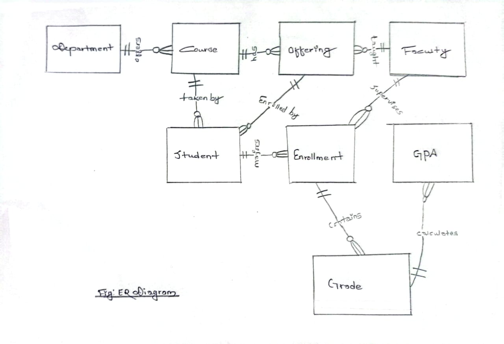

# Design Document
"University Management System"

By DEEPHANG THEGIM

Video overview: <https://youtu.be/bxq3zMLjwXY?si=WaqlpnshmGubp2RF>

## Scope

**Purpose:**
This database serves as the backbone for a comprehensive university management system, tracking academic records, course offerings, student enrollments, and faculty assignments to support administrative and academic operations.

**Included in Scope:**
- Student academic records and demographics
- Faculty information and teaching assignments
- Course catalog and scheduling by semester
- Department structures and affiliations
- Enrollment and grade management
- GPA calculation and academic standing

**Outside of Scope:**
- Financial transactions (tuition, fees, payroll)
- Physical resource management (classrooms, equipment)
- Human resources processes (hiring, benefits)
- Alumni relations and development
- Research grant management
- Campus housing assignments

## Functional Requirements

**Users Should Be Able To:**
- Register students for courses each semester
- Track and update student grades
- Generate official transcripts
- View teaching assignments for faculty
- Analyze course enrollment trends
- Calculate student GPAs
- Manage course offerings by department
- Produce departmental reports

**Beyond Scope:**
- Process financial aid applications
- Manage faculty promotion timelines
- Schedule classroom assignments
- Track extracurricular activities
- Handle student disciplinary records
- Manage graduate thesis committees

## Representation

### Entities

1. **Students**
   - id (SERIAL PRIMARY KEY)
   - last_name (VARCHAR(50) NOT NULL)
   - first_name (VARCHAR(50) NOT NULL)
   - email (VARCHAR(100) UNIQUE NOT NULL)
   - major_department_id (INTEGER REFERENCES departments)
   - enrollment_date (DATE NOT NULL)

2. **Faculty**
   - id (SERIAL PRIMARY KEY)
   - last_name (VARCHAR(50) NOT NULL)
   - first_name (VARCHAR(50) NOT NULL)
   - email (VARCHAR(100) UNIQUE NOT NULL)
   - department_id (INTEGER REFERENCES departments NOT NULL)
   - rank (VARCHAR(20))

3. **Courses**
   - id (SERIAL PRIMARY KEY)
   - code (VARCHAR(4) NOT NULL)  # e.g., 'COMP'
   - course_number (VARCHAR(4) NOT NULL)  # e.g., '101'
   - title (VARCHAR(100) NOT NULL)
   - credits (SMALLINT NOT NULL CHECK (credits > 0))
   - department_id (INTEGER REFERENCES departments NOT NULL)

4. **Course_Offerings**
   - id (SERIAL PRIMARY KEY)
   - course_id (INTEGER REFERENCES courses NOT NULL)
   - instructor_id (INTEGER REFERENCES faculty)
   - semester (VARCHAR(6) NOT NULL CHECK (semester IN ('Fall', 'Spring', 'Summer')))
   - year (INTEGER NOT NULL)
   - schedule (VARCHAR(50))
   - UNIQUE(course_id, semester, year)  # Prevent duplicate offerings

5. **Enrollments**
   - id (SERIAL PRIMARY KEY)
   - student_id (INTEGER REFERENCES students NOT NULL)
   - offering_id (INTEGER REFERENCES course_offerings NOT NULL)
   - grade (NUMERIC(2,1) CHECK (grade BETWEEN 0.0 AND 4.0))
   - UNIQUE(student_id, offering_id)  # Prevent duplicate enrollments

6. **Departments**
   - id (SERIAL PRIMARY KEY)
   - code (VARCHAR(4) UNIQUE NOT NULL)  # e.g., 'COMP'
   - name (VARCHAR(50) NOT NULL)  # e.g., 'Computer Science'

**Type and Constraint Rationale:**
- SERIAL keys for auto-incrementing IDs
- VARCHAR with appropriate length limits for text fields
- NUMERIC for grades to maintain precision
- CHECK constraints to enforce domain rules
- UNIQUE constraints to prevent duplicates
- NOT NULL for required fields
- Referential integrity via FOREIGN KEY constraints

### Relationships

The below entity relationship diagram describes the relationships among the entities in the database.

## Optimizations

**Indexes:**
1. `CREATE INDEX idx_student_name ON students(last_name, first_name);`
   - Optimizes student searches by name

2. `CREATE INDEX idx_course_department ON courses(department_id, code);`
   - Speeds up department-specific course queries

3. `CREATE INDEX idx_offering_semester ON course_offerings(semester, year);`
   - Accelerates semester-based offering lookups

4. `CREATE INDEX idx_enrollment_grade ON enrollments(offering_id, grade);`
   - Improves grade analysis performance

**Views:**
1. **Student_Transcripts**
   CREATE VIEW student_transcripts AS
   SELECT s.id, c.code, c.course_number, c.title,
          o.semester, o.year, e.grade, c.credits
   FROM students s
   JOIN enrollments e ON s.id = e.student_id
   JOIN course_offerings o ON e.offering_id = o.id
   JOIN courses c ON o.course_id = c.id;

2. **Faculty_Workload**

   CREATE VIEW faculty_workload AS
   SELECT f.id, f.last_name, COUNT(o.id) as courses_taught
   FROM faculty f
   LEFT JOIN course_offerings o ON f.id = o.instructor_id
   GROUP BY f.id;
   Simplifies workload reporting

## Limitations

 **Design Limitations:**

  Doesn't support:

  - Course prerequisites/corequisites

  - Multiple instructors per course

  - Cross-listed courses

  - Waitlist functionality

  - Section-based scheduling (lectures/labs)

  Student records:

   - No tracking of minors/second majors

   - Limited transfer credit handling

   - No academic standing calculation

   - Performance Considerations:

  GPA calculation requires:

   - Full table scan of enrollments

   - No built-in caching mechanism

   - Large enrollment scenarios:

   - Semester registration may create bottlenecks

   - Grade updates could lock records

   - Representation Challenges:

   - Complex scheduling:

   - No room assignment tracking

   - No time conflict detection

   - Limited recurring schedule patterns

